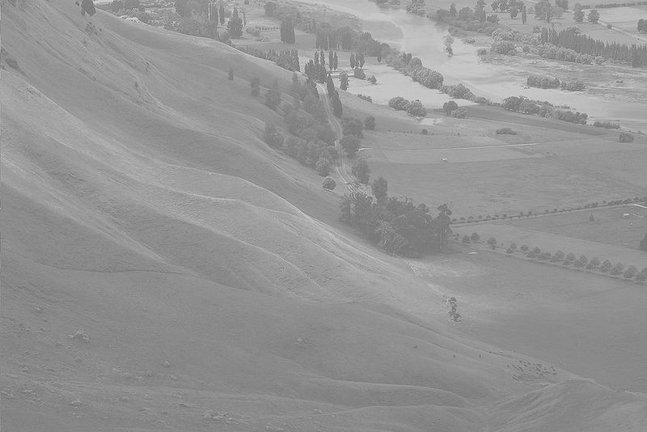
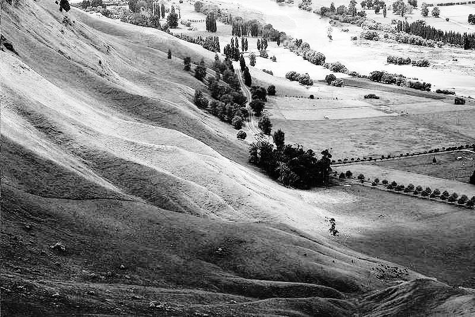
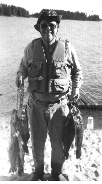
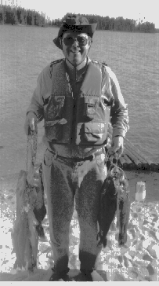

# DIP

Digital Image Processing

## 1. Histogram-Modification

### 1.1 Histogram Equalization

**Before histogram equalization**:

**After histogram equalization**:

---

### 1.2 Histogram matching

**Input**:

**Output**:

The output image has similar histogram to second input image.